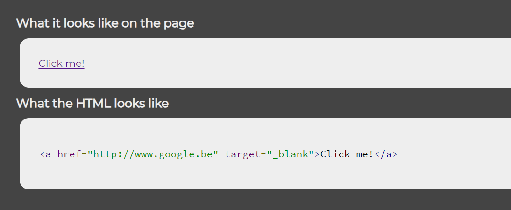
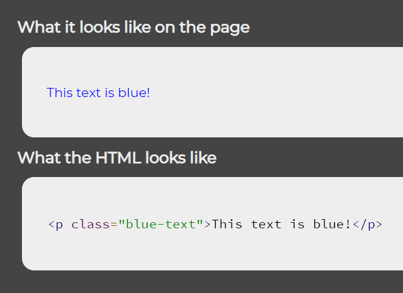

# 1. DOM element creation

This tool shows you what a dynamically created DOM object looks like, both in the browser and in HTML.

A basic tutorial on dynamic DOM element creation using JavaScript can be found **[here](https://www.w3schools.com/js/js_htmldom.asp)**.

Dynamically creating a DOM element
--

In the **js/script.js** file, you can create a new DOM element dynamically, e.g.:

    var newElement = document.createElement("a");

    newElement.setAttribute("href", "http://www.google.be");
    newElement.setAttribute("target", "_blank");
    newElement.innerText = "Click me!";

Don't forget to call the `Show()` method to display this dynamically created element:

    Show(newElement);

When you load the web page (**index.html**), it will show you what this element looks like on the page, and what its HTML looks like:

Using custom CSS
---

In the **css/styles.css** file, you can add custom CSS. This allows you to add pre-existing styling to your dynamically created DOM object.

For example, if you add this custom CSS rule:

    .blue-text {
        color: blue;
    }

And you dynamically create an element using this class:

    var newElement = document.createElement("p");

    newElement.className = "blue-text";
    newElement.innerText = "This text is blue!";

    Show(newElement);

The displayed element's text will actually be blue:

